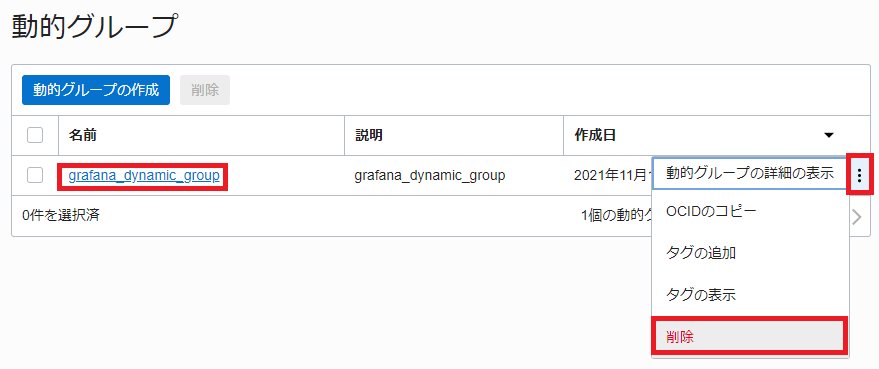
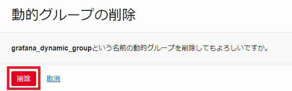
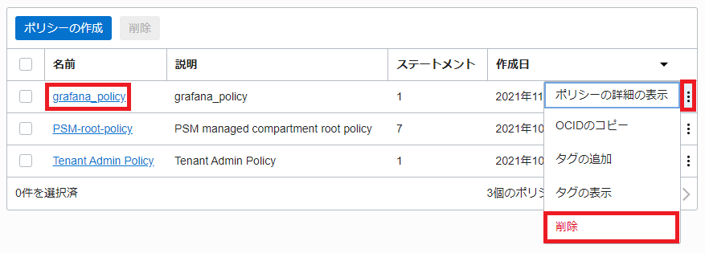

## 削除処理

### 1-1 ロードバランサの削除

CloudShellで以下のコマンドを実行します。

```sh
kubectl delete service istio-ingressgateway -n istio-system
```
コマンド結果
```sh
service "istio-ingressgateway" deleted
```

### 1-2 Kubernetesクラスタの削除

画面左上にあるハンバーガーメニューをクリックして、「開発者サービス」-「Kubernetesクラスタ(OKE)」を選択します。


リストにある「cluster1」の右端にあるプルダウンメニューから「削除」を選択します。


「cluster1」と入力して、「削除」ボタンをクリックします。


数分かかります。完全にKubernetesが削除されてから次のVCN削除を行ってください。

### 1-3 仮想クラウド・ネットワークの削除

画面左上にあるハンバーガーメニューをクリックして、「ネットワークキング」-「仮想クラウド・ネットワーク」を選択します。


リストにあるVCNの右端にあるプルダウンメニューから「終了」を選択します。


「すべて終了」ボタンをクリックします。


「閉じる」ボタンをクリックします。


仮想クラウド・ネットワークの削除は完了です。

### 1-4 動的グループとポリシーの削除

この作業は「5.OCI MonitoringのメトリクスをGrafanaダッシュボードを利用して確認してみよう【オプション】」を実施した場合に行ってください。  
画面左上にあるハンバーガーメニューをクリックして、「アイデンティティとセキュリティ」-「動的グループ」を選択します。


リストにあるま「grafana_dynamic_group」の右端にあるプルダウンメニューから「削除」を選択します。



「削除」ボタンをクリックします。



「ポリシー」を選択します。


リストから「grafana_policy」の右端にあるプルダウンメニューから「削除」を選択します。



「削除」ボタンをクリックします。


動的グループとポリシーの削除は完了です。

### 1-5 APMドメインの削除

この作業は「6.OCI APMを利用してトレーシングしてみよう【オプション】」を実施した場合に行ってください。  
画面左上にあるハンバーガーメニューをクリックして、「監視および管理」-「管理」を選択します。


リストにある「oke-handson-apm」の右端にあるプルダウンメニューから「APMドメインの削除」を選択します。


「oke-handson-apm」と入力して、「削除」ボタンをクリックします。


APMドメインの削除は完了です。

## 1-6 資材の削除

git cloneやダウンロードした資材を削除します。

```sh
cd ~
```
```sh
ls
```
コマンド結果
```sh
code-at-customer-handson  istio-1.11.0
```

```sh
rm -rf ./*
```

資材の削除は完了です。